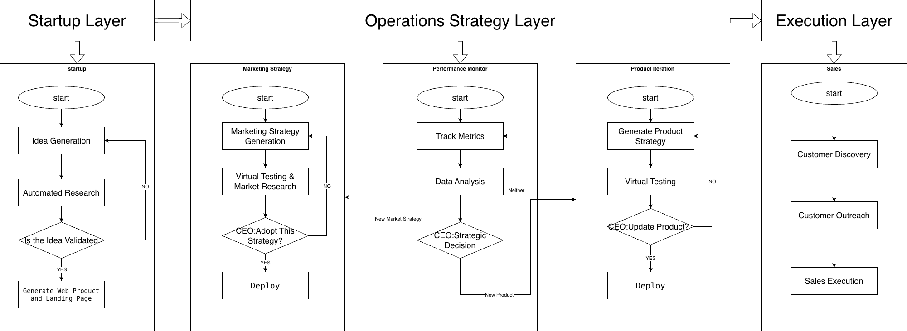

# CEOClaw

CEOClaw is an **OpenClaw-based founder agent harness** that acts like an AI startup founder.

It extends OpenClaw with founder-level capabilities to take a startup from **idea → launch → first customers**, with the goal of reaching **$100 MRR**.

## What CEOClaw Does

CEOClaw executes multi-step business workflows across four core areas:

### Product
- Generate startup ideas
- Run automated idea research
- Validate ideas before execution
- Build simple web products
- Generate landing pages
- Support product iteration and redeployment

### Marketing
- Generate marketing strategies
- Run virtual testing and market research
- Use social listening signals
- Launch SEO and campaign experiments

### Sales
- Identify potential customers
- Support outreach workflows
- Assist early sales execution

### Operations
- Track traffic, signups, and revenue
- Analyze performance and ROI
- Process feedback
- Trigger product or strategy updates

## Key Features

- **Built on OpenClaw** as the base agent harness
- **Founder-oriented extensions** beyond general-purpose agent workflows
- **Human-in-the-loop CEO decision layer** for high-level strategic judgment
- **Virtual research modules** using social listening, market research agents, and simulated A/B testing
- **Closed business loop** from idea generation to deployment, monitoring, and iteration

## Architecture

CEOClaw is organized into three layers.

### 1. Startup Layer

Flow:

**Start**  
→ **Idea Generation**  
→ **Automated Research**  
→ **Is the Idea Validated?**  
→ **Generate Web Product and Landing Page**

Notes:
- Idea generation can be interactive or autonomous.
- Automated research can include trend discovery, competitor analysis, and audience research.
- Validation can be done by the CEO agent, a human founder, or both.

### 2. Operations Strategy Layer

This layer contains three strategic loops.

#### A. Marketing Strategy

Flow:

**Start**  
→ **Marketing Strategy Generation**  
→ **Virtual Testing & Market Research**  
→ **CEO: Adopt This Strategy?**  
→ **Deploy**

Notes:
- Virtual testing may use social listening sub-models, simulated A/B testing, and market research agents.
- The CEO layer decides whether a strategy should be deployed.

#### B. Performance Monitor

Flow:

**Start**  
→ **Track Metrics**  
→ **Data Analysis**  
→ **CEO: Strategic Decision**

Possible outputs:
- Continue current strategy
- Launch a **new marketing strategy**
- Build a **new product**
- Trigger product iteration

Tracked signals may include:
- Traffic
- Signups
- Revenue
- ROI
- Funnel performance
- Feedback quality

#### C. Product Iteration

Flow:

**Start**  
→ **Generate Product Strategy**  
→ **Virtual Testing**  
→ **CEO: Update Product?**  
→ **Deploy**

Notes:
- Product updates can include feature changes, UX changes, pricing tests, and landing-page improvements.
- The iteration loop is driven by feedback, usage signals, and business performance.

### 3. Execution Layer

#### Sales

Flow:

**Start**  
→ **Customer Discovery**  
→ **Customer Outreach**  
→ **Sales Execution**

Notes:
- Customer discovery can be handled by research agents.
- Outreach can be agent-assisted.
- Sales execution may remain partially human-guided in early-stage scenarios.

## CEO Decision Layer

A core design choice of CEOClaw is that strategic decisions are not always fully automated.

The **CEO layer** can run in two modes:

- **Autonomous mode**: the CEO agent makes decisions directly from business signals
- **Human-guided mode**: a human founder provides judgment and overrides when needed

This is important because startup decisions often depend on a latent internal reward function: market sense, risk preference, product taste, and long-term judgment.

## What Is Added Beyond Base OpenClaw

Compared with base OpenClaw, CEOClaw adds:

- A startup execution architecture for **idea → launch → growth**
- Specialized founder workflows for **product, marketing, sales, and operations**
- A strategic **CEO approval loop**
- Market research and social listening agents
- Virtual testing modules for strategy and product decisions
- Monitoring and iteration loops tied to real business metrics

## Goal

CEOClaw is designed to demonstrate a working founder agent loop that performs real business tasks and pushes toward:

**first users, first customers, and $100 MRR**